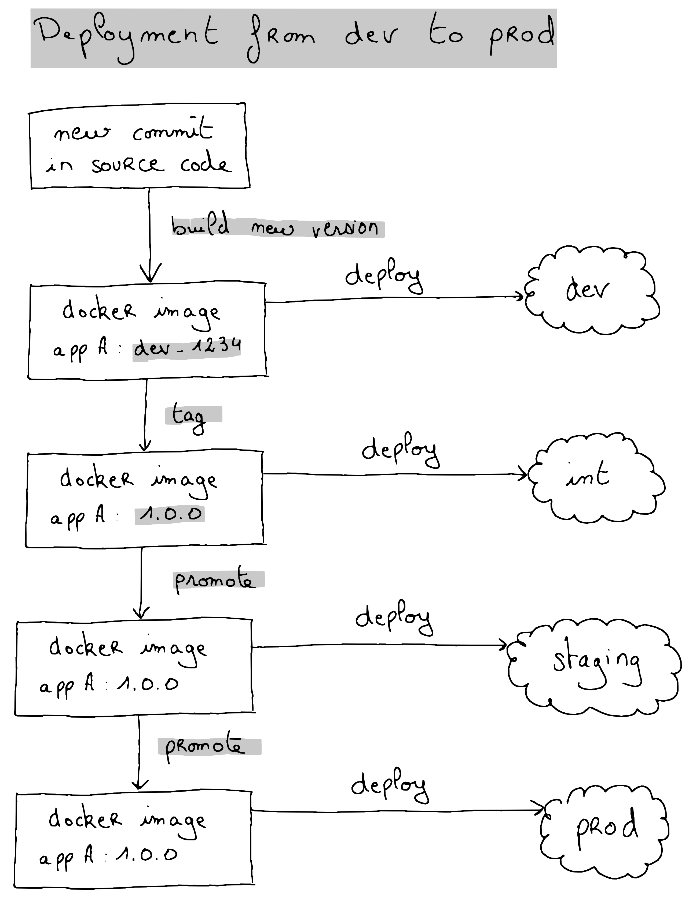
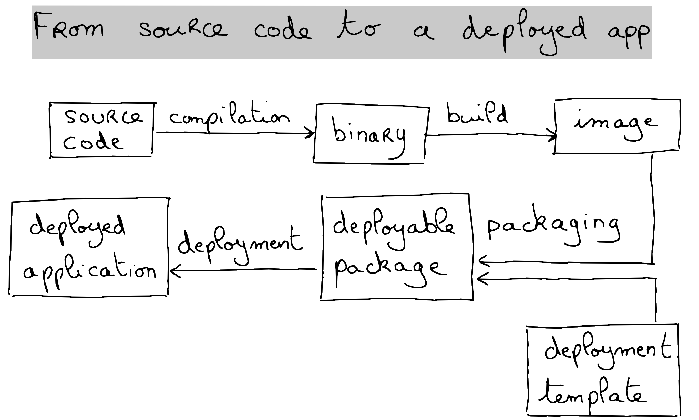
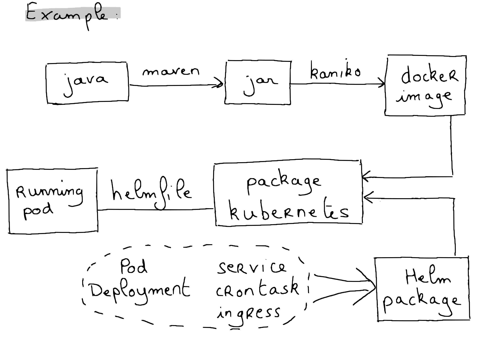

# Build and deploy pipelines

Building a deploying multiple versions of software components changed dramatically in the last years.
Where we sometimes could have as few as one deployment per quarter, it's now frequent to see several deployments a day.

More frequent deployments means more frequent testing, from the development team as well as from the final users.
This fast feedback loop allows to develop new functionalities and fix bugs much faster.
But more frequent deployments also implies a more complex and dynamic process.

# An example of implementation of Continuous Integration and Continuous Deployment (CICD) pipelines

In this article, we will discuss a concrete case, developed for one of our main clients.

## General principles of the CICD pipelines

### The development stages

We have 4 different stages on 4 corresponding environments:
- development: where every single new software build will be deployed and can be tested independently 
- integration: where software components are put and tested together
- staging: where software components are deployed in a prod-like environment
- prod: the stable environment that can be accessed by the final users.

TODO include image distinct stages

The application is deployed successively from the development environment to the production environment
following a fixed process.

### The application development lifecycle

The way to build and deploy a software can be described in a pretty generic way since the principles are often
very similar whatever the language and technologies.

This generic process is then implemented differently according to the language and the tools used.

## Detect vulnerabilities in the source code, SAST and DAST

A lot of plugin and tools allow developers to search for potential issues before they occur.
We speak mainly about Static Application Security Testing (SAST) and Dynamic Application Security Testing (DAST).
The Static Security Testing consist of analysing the source code for known bad patterns and the dependencies for
dependencies known to contain vulnerabilities.

One of the most know static analysis application is . This is a standalone application that can be linked with an
existing development environment. , an end-to-end software development platform, integrates natively security testing
plugins which we just need to activate to get security results aggregated into the dedicated dashboard.

// TODO include image of dashboard

Those results can eventually be pulled via the Gitlab API and included into your own customized pipelines.
Doing so, you can define your own 

## Build docker images with Kaniko

Building Docker images became a very common task in modern development environments.
Since the development environments are often hosted on Docker environments, we regularly face Docker in Docker issues:
building a Docker container in a Docker container requires to bypass important security features and is therefore unsafe.

Moreover, Docker container runtime has been  and we need a solution to build such containers 
on top of container engines like  or .

Luckily, Google released a tool named  that we can easily 

To simplify the whole process and allow developers to specify their build parameters in a convenient way, we developed a
custom process that analyzes the `docker-compose.yaml` to extract the build information : image name, image tag, build variables, etc.
Once the required information are acquired, we create a  which is gonna take care of the build of the image.

Dynamic Child Pipelines is a version of child pipelines wherein the child pipeline can be generated within a job or a set of jobs in the parent pipeline. The parent pipeline must put the generated CI configuration in an artifact, and then the trigger job refers to that artifact to tell the CI system what to run.

## Detect vulnerabilities in the Docker containers

## Manage Docker build dependencies

## Improve Java builds with build caches

# What could be improved

Test environments dynamically created for each test, each branch, each feature, each bug fix
