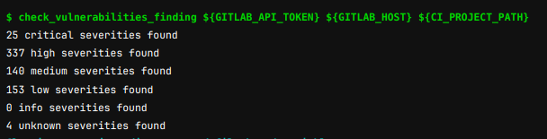

# Build and deploy pipelines

Building and deploying multiple versions of software components changed dramatically in the last years.
Where we sometimes could have as few as one deployment per quarter, it's now frequent to see several deployments a day.

More frequent deployments means more frequent testing, from the development team as well as from the final users.
This fast feedback loop allows to develop new functionalities and fix bugs much faster.
But more frequent deployments also implies a more complex and dynamic process.

# An example of implementation of Continuous Integration and Continuous Deployment (CICD) pipelines

In this article, we will discuss a concrete case, developed for one of our main clients.

## General principles of the CICD pipelines

### The development stages

We have 4 different stages on 4 corresponding environments:
- development: where every single new software build will be deployed and can be tested independently 
- integration: where software components are put and tested together
- staging: where software components are deployed in a prod-like environment
- prod: the stable environment that can be accessed by the final users.

TODO include image distinct stages

The application is deployed successively from the development environment to the production environment
following a fixed process.

### The application development lifecycle

The way to build and deploy a software can be described in a pretty generic way since the principles are often
very similar whatever the language and technologies.

This generic process is then implemented differently according to the language and the tools used.

## Detect vulnerabilities in the source code, SAST and DAST

A lot of plugin and tools allow developers to search for potential issues before they occur.
We speak mainly about Static Application Security Testing (SAST) and Dynamic Application Security Testing (DAST).
The Static Security Testing consist of analysing the source code for known bad patterns and the dependencies for
dependencies known to contain vulnerabilities.

One of the most know static analysis application is . This is a standalone application that can be linked with an
existing development environment. , an end-to-end software development platform, integrates natively security testing
plugins which we just need to activate to get security results aggregated into the dedicated dashboard.

Those results can eventually be pulled via the Gitlab API and included into your own customized pipelines.

Doing so, you can define your own 

## Build docker images with Kaniko

Building Docker images became a very common task in modern development environments.
Since the development environments are often hosted on Docker environments, we regularly face Docker in Docker issues:
building a Docker container in a Docker container requires to bypass important security features and is therefore unsafe.

Moreover, Docker container runtime has been  and we need a solution to build such containers on top of container engines like  or .

Luckily, Google released a tool named  that we can easily 
To simplify the whole process and allow developers to specify their build parameters in a convenient way, we developed a
custom process that analyzes the `docker-compose.yaml` to extract the build information : image name, image tag, build variables, etc.
Once the required information are acquired, we create a  which is gonna take care of the build of the image.

Dynamic Child Pipelines are a version of child pipelines wherein the child pipeline can be generated within a job or a set of jobs in the parent pipeline. The parent pipeline must put the generated CI configuration in an artifact, and then the trigger job refers to that artifact to tell the CI system what to run.

In a nutshell, our pipeline reads the docker-compose.yml file to get build information which will be passed to Kaniko in order to build the Dockerfile present in your project.

## Detect vulnerabilities in the Docker containers

Once built, our images are deployed to a  repository. This tool already includes the feature of analysing the container layers against know vulnerabilities. In our pipelines, we implemented a python script which requests the results of this analysis, what allows us to define some quality-gates in the deployment process. We can for example prevent any image with know severe vulnerabilities to be deployed in any of our environments.

## Manage Docker build dependencies

Most of our projects create a Docker container. Some of them are based on images which you can find on  and some others are based on images we build internally. Every time a parent image is updated, we want to build a new version of the downstream image to make sure we include all the latest security patches.

A dedicated program in Python was written to take care of creating and ordering the list of the dependencies between all the projects, according to the container images built and the inheritance between those. This program loops over all projects belonging to pre-specified groups that we manage and analyzes the Dockerfile. Two dependency trees are built during the process:
- one tree containing the mapping of Gitlab projects to containers images it creates
- another tree containing the mapping between a container image and the container image it inherits from.

Merging those two trees together allows us to know which Gitlab project depends on which other one and therefore, which downstream projects should be rebuilt, after a successful build of a specific project

The Python program then adds or updates a file containing the list of the downstream projects to trigger after a build in every concerned projects it loops over.

Finally, the code of the pipeline has been adapted to search for this particular file and loop over its entries after a successful build to trigger a build on every single listed project inheriting the current one in the current branch.

## Improve Maven Java builds with build caches

Maven is a wonderful tool allowing you to manage and download automatically all the dependencies you defined for your project.
When the build is running on Gitlab, it can run on different runners each time and therefore, might download hundreds of megabytes
every single time the build runs.
To mitigate this problem, we can make use of the cache functionality. To do so, we define the `.m2/repository` directory to be cached.
The very first time it will run, all dependencies will be downloaded by Maven. Then, those dependencies will be archived and stored.
During every single next build, this archive will be first expanded and all the previously downloaded dependencies will be made available
to the Maven tool. The later will only have to check and download for updates, if any.
This saves up sometimes more than 30 min per build for projects with a lot of dependencies.

# What could be improved

Test environments dynamically created for each test, each branch, each feature, each bug fix
